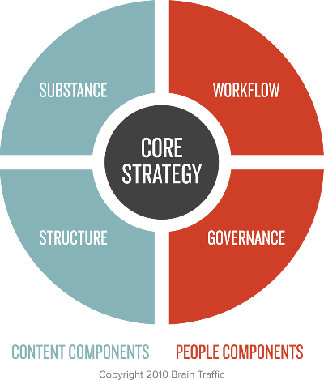
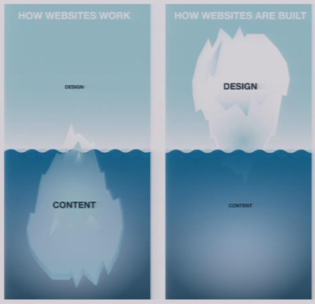

= Samenvatting Contentstrategie
Nick Rutten <hello@nickrttn.me>
v0.1, 4 Oktober 2015
:toc:

_Content strategy_ is the planning for creation, delivery, and governance of useful, usable content.

== 1. Content in a Zombie Apocalypse

Papier is diepgeworteld in hoe mensen denken over communicatie. 25 jaar is lang niet genoeg tijd voor ons om te beseffen hoe anders het web is. Maar met de opkomst van mobiele apparaten moeten we de notie van controle over presentatie opgeven. We moeten een manier vinden om te kunnen blijven publiceren voor de continue stroom van nieuwe apparaten. Daarnaast moeten we een manier vinden om onze content betekenis te geven zonder daarbij afhankelijk te zijn van de manier waarop we publiceren.

_Maar hoe bereiken we de visie van volledige scheiding van content en vorm?_

We moeten daarbij rekening houden met de betekenis van wat we proberen te communiceren, ongeacht de fysieke vorm van de uiting van de communicatie. Daarnaast moeten we ook rekening houden met hoe we structuur, prioriteit, relaties en hierarchie willen communiceren, los van de fysieke vorm, een enkel apparaat.

[WARNING]
====
We are fighting a war of blobs vs. chunks.
====

Blobs zijn grote stukken verzamelde content, waar alles in 1 veld opgeslagen is, content en markup.

Chunks daarentegen zijn _clean_, netjes opgemaakte, presentatie-onafhankelijke stukjes content die bedoeld zijn om op verschillende platformen en verschillende manieren gepresenteerd te kunnen worden.

De echte beperking hier is dat we, als industry, nog veel _container_-denken. We bedenken eerst een mooi ontwerp en dan pas waar we het mee gaan vullen. Maar dit is niet alleen een probleem van designers. Het gaat ook om de architectuur van onze CMS'en.

Om goede keuze te maken over wat we doen en wat we ontwerpen, hoe we content kunnen scheiden is het nodig om _content modeling_ toe te passen. Met content modeling bepaal je uit welke stukjes je content bestaat, en hierdoor kan het Create Once Publish Everywhere model (COPE van NPR) toegepast worden. We proberen met content modeling uit te zoeken wat de attributen van de content zijn.

== 2. Missie, visie & strategie

Een goed bedrijfsstrategie is de basis van een goede contentstrategie. De missie, visie en doelstellingen van het bedrijf zijn de basis van de contentstrategie.

Robert Kaplan en David Norton stellen dat strategie slechts een stap is in een reeks die begint bij missie en eindigt bij uitvoering. Met een goede strategie kan een onderneming zich dus onderscheiden. Strategie is hiermee leidend voor alle beslissingen die een organisatie neemt en dus ook voor de contentstrategie.

=== 2.1 Missie

Een missie definieert het bestaansrecht en identiteit van een organisatie. Het is daarbij belangrijk om jezelf de volgende vragen te stellen:

- Waartoe en waarom bestaat onze organisatie?
- Wat is onze identiteit? Wat is onze bestaansreden?
- Wat is onze primaire functie? Wat is ons ultieme hoofddoel?
- Voor wie bestaan we? Wat zijn onze voornaamste stakeholders?
- In welke fundamentele behoefte wordt door ons voorzien?

=== 2.2 Visie

Een visie is het beeld dat de verwachting van een organisatie heeft van de toekomst. Het gaat daarbij om het formuleren van een gezamenlijk vastgesteld toekomstbeeld en de gedroomde positie van de organisatie daarin. Hierbij is het belangrijk om je organisatie de volgende vragen te stellen:

- Wat is ons toekomstbeeld? Wat zijn onze langetermijnambities? Wat willen we bereiken?
- Wat is ons gemeenschappelijk beeld van een gewenste en haalbaar geachte toekomstige situatie en
- van het veranderingstraject dat nodig is om daar te komen?
- Waar staan we voor, wat verbindt ons, wie willen we zijn, wat is essentieel in onze houding en waar geloven we in (kernwaarden)?

Missie en visie zijn uitgangspunt voor het formuleren van organisatie doelstellingen in de vorm van kritische succesfactoren.

=== 2.3 Kritische succesfactoren (KSF)

Een KSF is een kenmerk van de organisatie dat essentieel is voor het toekomstige succes van die organisatie. KSF's kunnen betrekking hebben op de benodigde kerncompetenties van een organisatie, op USP's (Unique Selling Points), UBR's (Unique Buying Reasons), of op SCA's (Sustainable Competitive Advantages). Vragen om je organisatie te stellen:

- Welke factoren maken ons uniek?
- Wat is voor het succes van onze organisatie doorslaggevend?
- Welke factoren in de visie zijn essentieel voor de levensvatbaarheid van onze organisatie?

=== 2.4 Doelstellingen

Doelstellingen worden uitgewerkt in scenario's, maatregelen, interventies of verbeteracties waarmee concreet wordt uitgewerkt hoe resultaten bereikt worden. Vragen hierbij:

- Wat zijn de resultaten die we willen bereiken?
- Welke meetbare resultaten moeten we op welke plateaus bereiken?

=== 2.5 SMART doelen

Doelstellingen kunnen vertaald worden naar SMART doelen voor verschillende termijn. Vragen hierbij:

Zijn onze doelen:

- Specifiek?
- Meetbaar?
- Acceptabel (voor de belangrijkste stakeholders)?
- Realistisch?
- Tijdgebonden?
- Wat zijn onze streefcijfers en prestatie-indicatoren?

=== 2.6 Key Performance Indicators (KPI)

Met KPI's zijn resultaten meetbaar en stuurbaar. Vragen:

- Waarmee kunnen we resultaten meten?
- Wat maakt de visie en strategische doelen meetbaar?
- Welke waarden moeten gehaald worden? Wat zijn de streefcijfers?

== 3. Google Analytics Content Reports: Understanding the Key Benefits

GA's _Site Content_ reports have 4 sections:

- *All Pages*: Detailed interaction data on all pages.
- *Content Drilldown*: Data broken down by subfolder.
- *Landing Pages*: Page on which visitors entered.
- *Exit Pages*: Pages which have been the final page of a session.

=== 3.1 All Pages

A list of all pages of a site that have been viewed during a specific date range. Missing pages either didn't get viewed or the tracking code wasn't installed properly. Break the data down by Page or Page Title. You can see the following data:

- Pageviews
- Unique pageviews
- Avg. time on page
- Entrances
- Bounce Rate
- % Exit
- Page value

Page value requires goals to have values or e-commerce tracking.

==== 3.1.1 Content Groupings

Content groupings enable you to analyze different types of content on your site.

==== 3.1.2 Other Reports

===== 3.1.2.1 Navigation Summary

Shows you the pages users were on before and after a pageview of the selected URL. Allows you to see trends and track user journeys. Useful to check goal funnels and checkout progress and seeing how users got to a 404 page.

===== 3.1.2.2 In-Page Reports

Visual way to understand your content and on page activity. Use to find out what are common user flows in a visual way.

=== 3.2 Content Drilldown

The same data as in the All Pages report, broken down by subfolder.

=== 3.3 Landing Pages

About the pages users entered the website on. Useful when you are assessing marketing performance. Set this against Source/Medium to find out which page performs well with which marketing method. Exploiting this data can have a benefit for conversion rates and marketing ROI.

=== 3.4 Exit pages

The final pages in a users session. Checkout pages should be high on this list. Monitor this report for pages that can be improved for better conversion.

== 4. Core Strategy

[[img-content-strategy-quad]]

Before you start planning a content strategy you need to figure out what your core strategy is.

=== 4.1 What is a core strategy?

Content strategy defines how an organization will use content to achieve its objectives and meet its user needs. Core strategy sets the long-term direction for all content-related initiatives, ensuring all activities work together toward the future. Core strategy stays consistent. An effective core strategy is:

* *Flexible*: Withstands changing environment, accommodates various tactices and teams.
* *Aspirational*: Focuses on what you want to become.
* *Memorable*: It's an easily understandable concept used to guide activities and decisions.
* *Motivational*: Worthwhile and exciting, something people _want_ to be a part of.
* *Inclusive*: Leaves room for a wide variety of individual and team contributions.

A core strategy can be defined in a few brainstorm sessions. Keep the stakeholders' opinions into account.

=== 4.2 How do you develop and define a core strategy?

Brain Traffic's Lee Thomas helps organizations define their core strategy using 'Achieve-Be-Do'. This helps answer critical questions:

. *Achieve*: What does your content strategy need to accomplish?
. *Be*: What content products will we create?
. *Do*: What will we need to do to support the content effort?

==== 4.2.1 Tactical stuff first

Brainstorm tactics and solutions first. Then ask yourself:

- What do these tactics have in common?
- What are the business or cultural themes underlying them?
- What about these tactics or immediate concerns prohibits us from doing better, cooler stuff?
- If I didn't have to do this stuff, what would I like to do with our content instead?
- If I had a magic wand, and I could instantly solve these problems, what would I do next?

=== 4.3 What does a finished core strategy look like?

There are no hard rules for what a core strategy looks like. It doesn't have to be a big document, nobody reads those. It can be as short as one sentence, as long as it holds meaning for everyone involved. The key is short, memorable and focused on your content.

=== 4.4 The core strategy statement: an annotated sentence

The _core strategy statement_ is one of the tools we regularly use as a quick memorable summary of all core strategy details. You diagram a sentence that represents your strategy. Carefully select each word or phrase with your team, and annotate the sentence to explain your selections. Make sure the sentence sounds like you talk to your peers.

=== 4.5 So, what's the plan?

Never present a core strategy without including the first steps of a tangible action plan to demonstrate how the strategy works in practice.

=== 4.6 Content

How to define the *content components* of the content strategy quad.

- *Substance*: What content do you need and why?
- *Structure*: How will your content be prioritized, organized, formatted and displayed?

When you make a decision about one component of the quad, it likely has an impact on all three components. *Connecting the _content_ components and _people_ components is one of the most important roles that content strategy plays in your organization.*

=== 4.7 Substance

Your content must help you achieve project objectives, business goals, user goals, and long-term strategy. Identifying what content you need is a complicated process. Factors to consider are:

- Audience
- Messaging
- Topics
- Purpose
- Voice and tone
- Sources

=== 4.8 Audience: who are you trying to reach?

Your content will be much more effective and easy to manage if you set some parameters and priorities about who your content is for.

=== 4.9 Users: get specific

Start by defining user groups in detail. When you have a clear definition of your target domestic, you have a better chance of creating content they'll use. You also make sure your team talks about the same thing when they talk about a user group.

=== 4.10 Priorities: rank and file

Prioritize your user groups for each content channel or web property you have or want to have. Make a numbered list by priority users. Ranking them can identify gaps (fe. employee is not a target audience for the public website, but is for an intranet). Identifying and prioritizing target users are the first steps in creating content that works for users and your business.

=== 4.11 Messaging: what you want your users to remember

We define messages as bits of information you want the user to know and messaging as the art of deciding what information or ideas you want to give to and get from your users.

Messaging brings your core strategy to life by defining what content you need to communicate to reach your goals.

_Defining a message hierarchy_

The key to making messages valuable and understandable is putting them into a hierarchy that identifies message priorities. It would contain these components:

- *Primary message*: The most important thing you want the user to know after viewing your content.
- *Secondary messages*: A group of messages to support the primary message and provide context.
- *Details*: All of the proof points behind primary and secondary messages.

By identifying your main stories you have an easier time seeing specific content you need to support, enhance or expand on.

=== 4.12 Don't mistake messages for content

Messages are not meant to be copy on your website. You'll interpret the messages for each audience and situation. The messages will influence the content you select and create.

==== Topics: the subject that matter

Narrow the field of topics, find the right topic areas to meet your specific set of business requirements and user needs.

*Audience + Messaging = Topics*

==== Topic maps

A topic map shows how topics relate to each other. It helps to expedite linking strategies, metadata and CMS planning. In this map you can show how topics relate to each other, but also how topics relate to user segments, messages, channels or back-end infrastructure.

==== Purpose: every piece of content needs a job

You use different kinds of content depending on the content's purpose. Identifying the purpose helps you make informed decisions about what kinds of content you need. Examples of purposes:

- Persuade
- Inform
- Validate
- Instruct
- Entertain

Specific content may fulfill more than one purpose.

==== Voice and tone: watch your language

A company has one brand voice that has a distinct personality, style or point of view. The voice can take on different tones in different situations and for different purposes, depending on the specific audience.

==== Defining voice

Start by looking at any brand materials you already have. The voice might already be defined. Consider how it feels, what values live behind it, different media in which it might manifest. Explain to content creators by using clear, recognizable adjectives.

==== Defining tone

Look back at the information about your audiences. Combine with what you know about the user's native voice and the objective of your specific medium or channel content you are creating. Pick some words to describe tone.

==== Cultural differences

Style may vary across countries, states and regions.

=== 4.13 Final note: you can't always have what you want

Prioritize what gets done or done first with the following criteria:

- *Requirements*: is the content required for some reason (legally, politically, etc.)
- *Reach*: Which audience is the content likely to reach and how big is that audience?
- *Relevance*: How important and interesting is the content to users?
- *Richness*: How valuable or unique are we able to make this content?
- *Revenue*: How will the content affect site revenue generation?

== 5. Content Strategy and UX: a modern love story

____
It's inherently impossible to design a great user experience for bad content.
____

_What exactly is content strategy?_

Content strategy plans for the creation, delivery, and governance of useful, usable content.

[[img-content-strategy-quad]]

- *Core strategy*: defines how your content will help you meet business objectives.
- *Substance*: identifies what content is required to successfully implement your core strategy.
- *Structure*: how content is prioritized, organized and accessed.
- *Workflow*: how people manage and maintain content on a daily basis.
- *Governance*: describes policies, standards and guidelines that apply to content and its lifecycle, as well as how an organization will sustain and evolve its content strategy.

_Is content strategy a part of UX strategy?_

Not really. Not every content strategy needs UX strategy and not every UX strategy needs content strategy. They _are_ both required for effective execution of just about anything that requires or specifies the need for content creation, delivery or management. We should all be able to talk about shared _principles_, as there are multiple interdependencies between the roles, activities and artifacts of UX and content management.

_How does content strategy relate to UX design?_

Content strategy is a long term commitment to better content, a practice that beautifully complements the art and science of UX strategy.

== 6. Content before platform

The real problem for most companies isn't which format they choose to get their content on mobile. It's getting content on mobile at all. Chances are, you will _need_ to get your content onto the mobile web and into native apps.

Mobile's real challenge is _content strategy_: how are we going to create, manage and maintain our content across all platforms and devices. The first order problem is to develop processes and infrastructure to get your content into a format that your user can view on whichever platform they choose. Designing and developing for that platform, whatever platform, will be easier if you have content strategy in place.

=== 6.1 A separate mobile website

The idea of a separate mobile website rests on a false expectation about how you will manage and maintain your content:

[quote, Noz Urbina, 'Senior Consultant and Business Development Manager at Mekon Ltd.']
____
A mobile site as a solution implies two falsehoods: 1) mobile is just one platform and needs only one site to solve it and 2) maintaining separate sites per platform is going to be a sustainable strategy. Content is a constantly evolving body of assets that must be maintained and users will be accessing your content in various ways.
____

From a content strategy perspective, the risk of developing a separate mobile website is that you'll wind up maintaining duplicate content in multiple places. You want to avoid a forking nightmare from a maintenance perspective.

=== 6.2 Manage content like it's 1999

Don't fork your content! You will need to maintain everything multiple times. A CMS should help streamline publishing workflow on different channels and platforms. However, today, many CMS's don't support this type of multi-channel publishing without investment in development. Low-cost or mid-range CMS's do not provide this functionality, enterprise CMS's that are designed to support publishing to print and web can.

=== 6.3 You have a web CMS

Many CMS's are designed to only publish to the desktop web. That wasn't a problem because no one expected a CMS to have support for multi-channel publishing. But now, we have to fix this to deliver optimized experiences on desktop and mobile.

==== 6.3.1 Multi-theme management

Some CMS's support publishing to multiple templates. But these CMS's still like to publish the same content blob on those templates. They don't support publishing different content to different templates according to business rules. If you do want to do that, you are still forking your content.

=== 6.4 Responsive design to the rescue

Responsive design can save you from forking your content by handling conversion to different channels on the front-end. We should still care about evolving our content management tools and processing to effectively support multi-channel publishing.

=== 6.5 No forking way

The challenge for most organizations will be supporting a multi-channel editorial workflow, especially if they want to prioritize different content across platforms.

Keep in mind the effort required to manage and maintain less or different content for mobile users. To avoid the problem of content forking we need _adaptive content_.

== 7. Content as a service

America's National Public Radio (NPR) spent several years making content accessible through COPE (Create Once, Publish Everywhere). They now have a clean base of well-structured content for many platforms.

=== 7.1 Multiple content structures

NPR creates different types of:

- Summaries
-- Short summary
-- Long summary
- Body copy
-- Text
-- Audio
- Headlines (they don't do this, it's an option)
-- Short headline
-- Long headline

This gives NPR more flexibility to publish their content to multiple channels.

=== 7.2 Unique visual presentation

Using the multiple content structures NPR can design the best user experience for each platform. They can do it because they create structured content independent of presentation.

=== 7.3 How do they do it?

You need to create content that has the five key elements of adaptive content:

- *Reusable content*: developed to maximize reuse across platforms, or create different forms or types according to platform.
- *Structured content*: chunks can be combined in different ways for different platforms.
- *Presentation-independent content*: design decisions can be made for each platform.
- *Meaningful metadata*: metadata can be used to filter or highlight content and to help platforms decide which content to display.
- *Usable CMS interfaces*: Content Management UI and workflow encourages content creators to create well-structured and metadata-enhanced content without making presentation choices.

==== 7.3.1 Reusable content

Content creators need to plan for content reuse:

* *Written for reuse*
** Write standalone headlines (include keywords)
** Write multiple headlines (if it's not possible to write a single headline that works in every context)
** Don't bury the lede (put the most important information up front, focus on one main idea in each chunk)

Effective content reuse across platforms means you need a way to update content in one place and have the changes reflected everywhere.

===== 7.3.1.1 Alternative content

Not being able to access content because of the device or screen size you are using is frustrating. Supply alternative content when content can't be used. (Flash on iOS). These are usual suspects:

- Images
- Data visualizations
- Audio and videa

==== 7.3.2 Structured content

The foundation of adaptive content: to make content flexible for reuse you need to structure it into meaningful chunks. Content is stored in a database. The way we structure the database gives content more meaning, enabling us to do more with it.

If you want content to be reusable, flexible and adaptable to change, it needs structure. Create appropriate chunks of content instead of one big blob.

===== 7.3.2.1 Content modeling

Modeling is the way to turn content into a defined, organized system of:

- *Content types*
- *Attributes*
- *Data limits*
- *Relationships*

*Content modeling in a CMS*

Ask users to enter content into discrete fields in a CMS. However, the content model needs to reflect the needs and goals of content creators. They need to write content for the chunk and not for the page.

Your goal is to create a flexible base of content with a variety of structured content objects (a _content package_) to cover a wide range of uses and contexts. If you create content packages and think of developing multiple content structures with that packages, you are planning ahead to make it easier to create, maintain and govern that content.

*Responsive content*

Two things are required to deliver on the idea of responsive content:

. It has to be structured in chunks.
. The right design system has to make sense of the content in the right context.

==== 7.3.3 Presentation-independent content

[quote, Ethan Resnick, Design student at NYU]
____
Metadata is the new art direction.
____

Every platform is unique. Separate content from presentation from the start. Content creators often demand WYSIWYG-editors to style their content. They shouldn't get those because they embed formatting in content.

We define  meaning to often by how content looks or where it lives:

- *At the field level* encoding information by styling alone
- *At the page level* encoding information through layout

==== 7.3.4 Meaningful metadata

Content creators need to enter content into separate fields in the CMS because those fields and tags represent metadata. Even if you not using all metadata  it still makes the content more flexibe and valuable in the future.

Metadata allows you to achieve many goals of adaptive content:

- *Content reuse* metadata is needed for each platform to know what to do.
- *Structured content* defined by metadata
- *Presentation-independence* metadata gives meaning to content.

Content management tools should make it as easy as possible to create structured, presentation-independent content with the appropriate metadata.

==== 7.3.5 Usable CMS

- A good user experience depends on a well-defined authoring and publishing workflow.
- Technology should be designed to facilitate user needs and goals.
- Usability is evaluated on overall workflow, not on individual screens.
- Organizations recognize that a CMS is there to facilitate and manage human processes and tasks.

=== 7.4 Adaptive content first

Adaptive content puts your content at the center of your strategy and publishing process. It helps you achieve _content parity_ where all users, regardless of device, get the same content. It also gives you the flexibility to serve up different content intentionally to users according to device, screen size or context.

== 8. Content modeling

A content model allows you to represent content in a way that translates intention, stakeholder needs and functional requirements from the UX design into something that can be built by a developer implementing a CMS.

=== 8.1 What is a content model?

A content model documents all the different types of content you will have for a given project. It contains detailed definitions of each content type's elements and their relationships to each other.

You can break down each content type into its components and provide information for each such as the format in which you expect each attribute.

=== 8.2 Why is a content model important?

A content model helps clarify requirements and encourages collaboration between the designers, the developers creating the CMS, and the content creators.

- *For information architects and designers*: the content model helps information architects and designers make sure designs accomodate all the content types for the site and gives hints about content availability for each page. The model needs to support the content, layout and functionality shown in the designs.
- *For developers*: the content model helps developers understand content needs and requirements as they configure the CMS.
- *For content authors and producers*: the content model gives authors and producers guidelines on what content to create and how to enter it into the CMS.

=== 8.3 How do you create a content model?

Three things to consider:

. *The assembly model*: the way content creators will put individual items together to make content types.
. *The content types*: the various configurations of unique content types.
. *The content attributes*: content and metadata elements that make up each type, including their interrelations.

==== 8.3.1 The assembly model

Consider:

- How modular does the content need to be? (1 press release = 1 page, 1 Q/A = one of a series in a FAQ)
- How structured does the content need to be?
- How flexible does the content need to be?
- How reusable does the content need to be?
- How tolerant are your content creators of laborious processes?

==== 8.3.2 The content types

Questions about how structured your content needs to be will help determine what constitutes a distinct content type. Abstract the kinds of content you are creating and look for patterns. Do your content types have any attributes in common and could they be one type?

Other reasons to make something a separate type of content:

. Distinct, reusable elements (fe. an Author content type, to be included on anything the author publishes)
. Functional requirements
. Organizational requirements (do I need to filter certain pages that look the same as others?)

==== 8.3.3 The content attributes

Identify each element of each content type. This includes content, metadata and relationships to other content types. Determining these elements can be challenging. Consider:

- Layout
- Reuse
- Sorting and filtering

Also capture information about what format each element should be in and whether or not it's required. Coordinate with a business analyst to make sure your recommendations are aligned.

==== 8.3.4 Content model documentation

The content model serves different audiences at different stages of a project. Treat it as a living document. It will mainly be used internally by a project team, it helps to create a CMS that meets design, tech and business needs and serves the people that will use the CMS.

== 9. Findable content

=== 9.1 More structured, more findable

Structured content gives users much more to find by using meaningful chunks, metadata and content separated from presentation. Every attribute of the content can be used to increase and enhance the ways to find it.

=== 9.2 Search engine findability

Consider whether your content is adequately visible to, and understood by, search engines instead of focusing on rankings.

=== 9.3 Keyword-rich content attributes

Keywords are the words your audience naturally uses when looking for your product, service or information. Make categories and attributes logical for your users, align with their mental models and match their needs.

=== 9.4 Don't fear keyword search

Try getting a big-picture overview by looking at how people search for your product or service online by using Google Trends, which lets you compare searches over time for two or more words you think are commonly used by your audience.

=== 9.5 Content hubs

If you work with a site where multiple content types share a single attribute, use that attribute to create hubs of content around a topic (fe. businesses, hotels, parks and attractions all share the attribute 'city').

These sort of hubs help users find things the way they want, and help you gain more traction with search engines. When all content on a topic is aggregated, organized and maybe even curated, it creates a canonical presence. This can improve your SEO results substantially.

Properly structured, semantic content is a great place to start improving visibility in search.

=== 9.6 Site search findability

Improving the performance of your own site's search engine is often a simple way to get immediate improvements to a website's performance. By analyzing what users search for you can make sure the results they're getting are the most appropriate, relevant ones.

*Getting started with site search*

The better your content is structured, the easier it is to improve your site's search engine. When your content is stored in modular parts, you are giving your search engine more to work with. It also gives you lots of easy ways to tune your search engine results systematically.

_By content type_

You can give some content types more or less priority in search results. Additionally, you can give different elements of content more or less priority, such as summaries (which hold the most important idea of your content).

=== 9.7 Smarter, faceted search

Faceted search allows users to sort and filter content using multiple criteria.

=== 9.8 Related and contextually discoverable content

Create ontological relationships at the deepest level of content, to show related content to users. Make sure it has a very strong relationship to the currently viewed content.

=== 9.9 Finding soul in findability

Design content models that fit your users' mental models to assure your content experience doesn't become robotic. Allow robots to do only some of the work, and save your human capital for the most important content.

== 10. Articles

=== 10.1 What is intellectual property?

==== 10.1.1 What is intellectual property?

Intellectual property (IP) refers to creations of the mind:

- Inventions
- Literary and artistic works
- Symbols, names and images used in commerce

IP is divided into two categories:

* *Industrial Property*
** patents
** trademarks
** industrial designs
** geographical indications

* *Copyright*
** literary works
** films
** music
** artistic works
** architectural design

IP rights allow creators or owners to benefit from their own work or investment in a creation. These rights are outlined in Article 27 of the Universal Declaration of Human Rights.

The importance of IP was first recognized in the Paris Convention for the Protection of IP (1883) and the Berne Convention for the Protection of Literary and Artistic Works (1886). Both treaties are being administered by the World Intellectual Property Organization (WIPO).

===== Why promote and protect intellectual property?

. The progress and well-being of humanity rest on its capacity to create and invent new works in the areas of technology and culture.
. The legal protection of new creations encourages the commitment of additional resources for further innovation.
. The promotion and protection of IP spurs economic growth, creates new jobs and industries, and enhances the quality and enjoyment of life.

===== How does the average person benefit?*

IP rights reward creativity and human endeavor, which fuel the progress of humankind.

==== 10.1.2 What is a patent?

A patent is an exclusive right granted for an invention. A patent provides patent owners with protection for their inventions for a limited period, generally 20 years.

===== Why are patents necessary?

Patents provide incentives to individuals by recognizing creativity and offering the possibility of material reward for marketable inventions. These incentives encourage innovation, which in turn enhances the quality of human life.

===== What kind of protection do patents offer?

Patent protection means an invention cannot be commercially made, used, distributed or sold without the patent owner's consent.

===== What rights do patent owners have?

A patent owner has the right to decide who may – or may not – use the patented invention for the period during which it is protected. Patents can be sold. Patents can expire and enter the public domain, upon which it becomes available for commercial exploitation by others.

===== What role do patents play in everyday life?

In return for patent protection, all patent owners are obliged to publicly disclose information on their inventions in order to enrich the total body of technical knowledge in the world to increase creativity and innovation.

===== How is a patent granted?

By filing a patent application.

===== What kinds of inventions can be protected?

An invention must fulfull the following conditions to be protected by a patent:

- Must be of practical use
- Must show an element of novelty
- Must show an inventive step
- Subject matter must be accepted as patentable

===== Who grants patents?

National patent offices or regional offices that carry out examination work for a group of countries (fe. the European Patent Office (EPO) and the African IP Organization (OAPI)). The WIPO-administered Patent Cooperation Treaty (PCT) provides for the filing of a single international patent.

==== 10.1.3 What is a trademark?

A trademark ((TM)) is a distinctive sign that identifies certain goods or services produced or provided by an individual or company.

===== What do trademarks do?

(TM) protection ensures that the owners of marks have the exclusive right to use them to identify goods or services, or to authorize others to use them in return for payment.

(TM)'s promote initiative and enterprise worldwide by rewarding their owners with recognition and financial profit.

===== What kinds of trademarks can be registered?

(TM)'s may be one or a combination of words, letters and numerals. They may consist of drawings, symbols or three-dimensional signs, such as the shape and packaging of goods.

Collective marks are owned by an association whise members use them to indicate products with a certain level of quality and who agree to adhere to specific requirements set by the association.

===== How is a trademark registered?

. An application for registration of the (TM) is filed with the appropriate national or regional (TM) office.
. The rights applied cannot be the same as, or similar to, rights already granted to another (TM) owner.

===== How extensive is trademark protection?

Almost all countries in the world register and protect trademarks. WIPO administers an international system for trademark registrations, governed by the Madrid Agreement Concering the International Registration of Marks, and the Madrid Protocol.

==== 10.1.4 What is an industrial design?

An industrial design refers to the ornamental or aesthetic aspects of an article. To be protected under most national laws, an industrial design must be new or original and non-functional.

===== Why protect industrial designs?

Industrial designs make an article attractive and appealing; they add to the commercial value of a product and increase its marketability.

===== How can industrial designs be protected?

In most countries, an industrial design must be registered in order to be protected under industrial design law.

===== How extensive is industrial design protection?

Generally, industrial design protection is limited to the country in which protection is granted.

==== 10.1.5 What is a geographical indication?

A geographical indication is a sign used on goods that have a specific geographical origin and possess qualities or a reputation due to that place of origin.

===== What is an appellation of origin?

An appellation of origin is a special kind of geographical indication used on products that have a specific quality exclusively or essentially due to the geographical environment in which the products are produced.

===== Why do geographical indications need protection?

Geographical indications are understood by consumers to denote the origin and quality of products. Many of them have acquired valuable reputations.

===== What is the difference between a geographical indication and a trademark?

A trademark is a sign used by a company to distinguish its goods and services from those produced by others. A geographical indication guarantees to consumers that a product was produced in a certain place and has certain characteristics that are due to that place of production.

===== What is a “generic” geographical indication?

If the name of a place is used to designate a particular type of product, rather that to indicate its place of origin, the term no longer functions as a geographical indication.

===== How are geographical indications protected?

Geographical indications are protected in accordance with national laws and under a wide range of concepts, such as:

- laws against unfair competition
- consumer protection laws
- laws for the protection of certification marks
- special laws for the protection of geographical origin or appellations of origin

===== What is WIPO's role in the protection of geographical indications?

WIPO administers a number of international agreements that deal partly or entirely with the protection of geographical indications.

==== 10.1.6 What are copyright and related rights?

Copyright ((C)) laws grant authors, artists and other creators protection for their literary and artistic creations, generally referred to as “works”. Closely associated are “related rights”, which are related to (C) that encompass rights similar or identical to those of (C), although sometimes more limited and of shorter duration.

===== What rights do copyright and related rights provide?

The creators of work protected by copyright, and their heirs and successors have certain basic rights under copyright law to authorize or prohibit:

- its reproduction in all forms
- its public performance and communication to the public
- its translation into other languages
- its adaptation

Copyrights expire not less that 50 years after the creator's death. This may be longer in some countries.

===== What are the benefits of protecting copyright and related rights?

Giving authors, artists and creators incentives in the form of recognition and fair economic reward increases their activity and output and can also enhance the results.

===== How have copyright and related rights kept up with advances in technology?

The field of copyright and related rights has expanded enormously during the last several decades with the spectacular progress of technological development. WIPO is involved in ongoing international debate to shape new standard for copyright protection in cyberspace. WIPO administers the WIPO Copyright Treatment (WCT) and the WIPO Performances and Phonograms Treaty (WPPT), known as the “Internet treaties”.

===== How are copyright and related rights regulated?

Copyright and related rights protection is obtained automatically without the need for registration or other formalities.

==== 10.1.7 What is the World Intellectual Property Organization?

WIPO (1970) is an international organization dedicated to helping ensure that the rights of creators and owners of IP are protected worldwide, and that inventors and authors are recognized and rewarded for their ingenuity.

===== How does WIPO promote the protection of IP?

WIPO serves as a forum for its Member States to establish and harmonize rules and practices for the protection of IP rights. WIPO also maintains global registration systems for (TM)'s, industrial designs and appelations of origin, and a global filing system for patents.

===== How is WIPO funded?

WIPO generates more than 90% of its budget through its international registration and filing systems, as well as through publications, arbitration and mediation services. The remaining funds come from contributions by member states.

=== 10.2 Content and design are inseparable work partners

Everything on your website is content, not just your main product or service. We need to shift our definition of content to what the user needs right now. If the user needs it, it's content.

Content is the entire reason people come to the design in the first place.

Eight key skills for a UX designer:

- user research
- interaction design
- information architecture
- visual design
- copywriting/content strategy
- design process management
- information design
- editing/curation

We need to integrate content and design teams if we want our content and design to feel integrated for our users.

=== 10.3 How to conduct a content audit

One of the first tasks you'll need to perform on any redesign project involving a large amount of content is a _content audit_. A content audit is checking all the content on a website and compiling it into a big list. There are 3 types:

- *Full content inventory* complete listing of _every_ content item on the site.
- *Partial content inventory* listing of a _subset_ of the site's content
- *Content sample* less detailed collection of example content from the site.

==== What is a content audit used for?

The main purpose is to produce a listing of the site's content, in a big spreadsheet.

It is used in various stages of a redesign:

- information architecture
- talking to authors about managing and rewriting content
- keeping note of what you started with

By doing an content audit you'll get a better understanding of the content. You can:

- find things you didn't know existed
- spot duplication
- identify relationships

==== What does a content audit include?

The following information for every page:

- Navigation title
- Page name
- URL
- Comments
- Content hierarchy

Possible information includes:

- Content type
- Basic content description
- Topic, tags or category
- Author
- Owner
- Date last updated
- Attached files
- Related
- Availability
- A numbering system

==== Where to begin?

Start by creating a list of top-level items, often matching primary navigation. Repeat the process for sub pages of the top-level items. Don't capture information you don't need.

A content audit for a brand new site can be useful. Make a list of all the resources you'll be using.

[NOTE]
====
That's all folks!
====

== 11. Aantekeningen Kick Off

=== Wat is content?

[quote, Erin Kissane]
____
 *In the web industry anything that conveys meaningful information to humans is called content.*
____

Content:

- brengt informatie over
- communiceert ideeën
- prikkelt de verbeelding
- vangt interesse
- zet aan tot actie
- bevredigt een behoefte
- ondersteunt een doel
- drukt een mening uit

Zonder content:

- geen interactie
- geen UX
- geen context
- geen aandacht
- geen conversie
- geen resultaat

=== Wat is strategie?

De manier waarop middelen worden ingezet om lange termijn doelen te bereiken.

[quote, Sun Tzu, Chinese Military Strategist]
____
“Strategy without tactics is the slowest route to victory. Tactics without strategy is the noise before the default.”
____

=== Strategie vs. tactiek

| Strategie            | vs. | Tactiek               |
| -------------------- | --- | --------------------- |
| Plannen              | vs. | Doen                  |
| Grote schaal         | vs. | Kleine schaal         |
| Waarom 					 | vs. | Hoe                   |
| Moeilijk te kopiëren | vs. | Makkelijk te kopiëren |
| Lange termijn        | vs. | Korte termijn         |

|            | Strategie                 | Tactiek                       |
| ---------- | ------------------------- | ----------------------------- |
| Focus      | Toekomst                  | Nu                            |
| Gericht op | Visie                     | Doelen                        |
| Voorkeur   | Verandering               | Stabiliteit                   |
| Voorkeur   | Innovatie en creativiteit | Betrouwbare techniek          |
| Kijkt      | Extern (gebruikers)       | Intern                        |
| Benadrukt  | Omgeving                  | Organisatie                   |
| Wil        | Alle opties overwegen     | Bestaande situatie verbeteren |

=== Wat is contentstrategie?

Content strategy plans for the creation, delivery, and governance of useful, usable content.

Content strategy helps you understand not only what content needs to be created, but why.

[[img-content-strategy-quad]]

==== Substance

- Wat zijn de (content)behoeftes van de gebruiker en jouw organisatie en waarom?

==== Structure

- Hoe is content georganiseerd, geprioritiseerd en ontsloten?

==== Workflow

- Hoe wordt content geproduceerd en onderhouden?

==== Governance

- Hoe worden beslissingen over content en contentstrategie genomen?

=== Filosofie

*COPE*

**C**reate **O**nce **P**ublish **E**verywhere

Je maakt content 1&times; waarna je het overal kunt gebruiken.

Contentstrategie is nodig omdat 90% van de gebruikers dagelijks meerdere schermen gebruikt om 1 taak te voltooien. Bijvoorbeeld: mensen zoeken producten mobiel, maar betalen op de desktop.

[quote, Gerry McGovern]
____

The essence of the web is action. We go to the web because we have a task; there is something we need to do; there is a problem we need to solve.

What helps us do? What helps us act?
____

We hebben een behoefte die we willen vervullen. De content zorgt dat we dat kunnen. Daarom moet deze ook goed zijn.

- Contentstrategie is belangrijk
- Het gaat uiteindelijk om de gebruikerservaring
- Contentstrategie is een proces, maar niet lineair
- Er zijn meer wegen die naar Rome leiden

=== Content strategie en eenhoorns – Peet Sneekes

@peetsneekes – Mirabeau – Creatief consultant

Contentstrategie is niks zonder dat je een verhaal kunt vertellen. Gevoelens en verwachtingen beïnvloeden is een belangrijk onderdeel van contentstrategie.

Wat hierbij belangrijk is, is het pad naar een contentstrategie toe. Wat je zegt in de contentstrategie en waarom je het verhaal vertelt, met welke informatie en met welke toon. Het waarom is waar je je mee bezig houdt.

Een goede contentstrategie komt neer op het maken van magie, een lezer of gebruiker in vervoering brengen.

Het belangrijkste is dat je ervoor zorgt, met je regels en je contentstrategie, dat de magie niet gebroken wordt. Je bent verantwoordelijk voor het in stand houden van de magie. Dit zit hem in een aantal onderdelen:

- De dingen die je zegt moeten kloppend en consistent zijn.
- De complete gebruikerservaring

==== Contentstrategie = emotie

Hou rekening met welke dingen je vertelt, en met name ook met wie je publiek is. De emotie is hierbij het belangrijkst. Probeer altijd in te spelen op de emotie die je publiek doormaakt. De situatie waarin iemand zit, en hoe diegene die situatie ervaart veroorzaakt die emotie. Die situatie kun je beïnvloeden.

Contentstrategie gaat eigenlijk niet over informatie, technieken en structuren. Dat zijn slechts tools om je doel te bereiken. Je doel is begrijpen wie je voor je hebt, welke emoties die hebben, en wat ze nodig hebben om ze de volgende stap te laten zetten.

Het juist toepassen van je contentstrategie is ook belangrijk. Je moet deze goed kunnen interpreteren. Dat is voornamelijk ervaring. Hou daarbij vooral ook je doelen voor ogen.

De weg die een gebruiker aflegt naar het doel dat je wilt dat ze bereikt heet de *customer journey*. Hiermee probeer je het gemiddelde gedrag van gebruikers te voorspellen. Vergeet niet dat alle gebruikers anders zijn en je product in een andere context gebruiken. Daarmee is het niet te voorspellen, maar wel te beïnvloeden.

Het beïnvloeden van mensen, ze onbewust keuzes laten maken, heet *persuasive design*. Dat is nogal *evil*. Probeer dat op een sympathieke manier op te lossen.

Tip: contentstrategy van Mailchimp.

Verhalen vertellen wordt steeds makkelijker met verschillende social media. Vaak is succesvolle content een ongeluk. In plaats van een ongeluk moeten we een structurele ervaring zien te creëren door vaardig te worden in het creëren en presenteren van content.

[quote, Ira Glass]
____

Looking for great stories takes just as much time as the writing does. Not enough get said about the importance of abandoning crap. Failure is a big part of success. There's a gap between your work and your tase. Do lots of work to close the gap. Put yourself on a deadline. It's going to take a while so fight your way through it.
____

Ontwikkel je smaak door te doen. Zoek je richting. Zoek waar je moet verbeteren.

=== Contentstrategie, of: neem je content serieus – Joanne Gerrits

@joannegerrits – Contentfreak

==== Twee dingen

- Denk eerder aan je content
- Metadata en structuur is goud

[quote, Karen McGrane]
____
Because we all want the same thing but content keeps getting in the way.
____

Content levert vaak problemen op als je er niet genoeg over nadenkt of als je meerdere kapiteins hebt.

==== Het probleem met websites

[[problem-with-websites]

[quote, Kristina Halverson]
____

Contentstrategie helpt ons om te bepalen **wat** we moeten publiceren, **voor wie**, **waar**, **wanneer**, en **hoe** we dat voor elkaar kunnen krijgen.
____

Vijf dingen die je moet kunnen als contentstrateeg:

. Vraag waarom
. Denk zo vroeg mogelijk na over content
. Spreek de verschillende talen van de business
. Creëer een content fanbase
. Trakteer op goede koffie

Nog een paar dingen om mee te nemen:

* Content is meer dan woorden. Het krijgt pas **betekenis** en **waarde** met:
** de juiste vorm
** de juiste tone of voice
** de toevoeging van andere contentvormen
** context en navigatie
** relevante gerelateerde andere content
** Als het iets zegt, laat voelen, zien of communiceert is het content.
* Content kent meer gebruikers dan alleen bezoekers.
* Investeer in slimme content.
** Metadata
** Taxonomie
* Denk verder dan content die gelimiteerd is tot één doel, technologie of output. (COPE)
* Hoe beter je content structureert, hoe beter je ze kunt presenteren.
* Contentstrategie bevindt zich op elk niveau van het model van JJG.

[quote, Lisa Welchman]
____
Digital is not a project. After redesign the website is still there.

Na het bouwen van de website begint het pas. Denk vooruit, hoe zorg je ervoor dat content te managen blijft?
____

